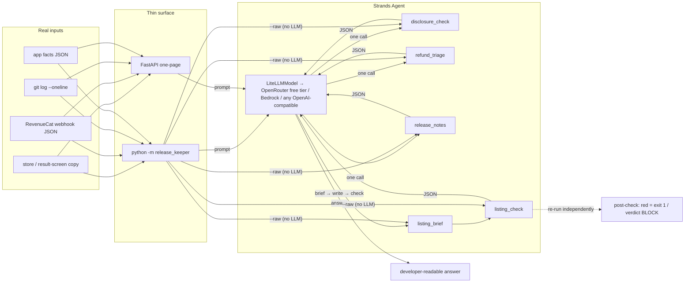

# ReleaseKeeper

Release-operations agent for solo app developers. Built for the
[Agents for Humans](https://agentsforhumans.devpost.com) hackathon (2026) on the
**Strands Agents SDK**.

Every app release repeats the same judgment-heavy chores: check that the store
listing and result screens carry the disclosures an AI app needs, classify
refund requests and draft replies, write release notes, localize the listing.
Miss one and you get a store rejection or a chargeback. ReleaseKeeper is one
Strands agent with four tools that does these from real inputs (copy text,
payment-webhook payloads, git log).

## Status (building 2026-09-04 → 09-13)

| Tool | State |
|---|---|
| `disclosure_check` — scan copy for AI disclosure, framing, refund/deletion/age/crisis lines | ✅ |
| `refund_triage` — classify a RevenueCat webhook event, say what to do to the entitlement, draft the reply (en/ko) | ✅ |
| `release_notes` — turn `git log --oneline` into New/Improved/Fixed notes + store 'what's new' under the Play cap; the CLI/web re-measure the block the model wrote | ✅ |
| `listing_brief` + `listing_check` — caps, structure and the disclosure block for the model to write from, then a deterministic check of what it wrote (Play / App Store, en·ko fully checked, other languages structural + native-review flag) | ✅ |

## Quick start

```bash
python -m venv .venv && . .venv/bin/activate
pip install -e ".[dev]"
pytest -q                                   # 51 unit tests (tools + web), no LLM needed

# deterministic scan, no LLM
python -m release_keeper check examples/saju_listing_bad.txt --payments --category fortune --raw

# refund triage from a RevenueCat webhook body (no LLM)
python -m release_keeper refund examples/rc_refund_consumable.json --products examples/products.json --raw

# release notes from a git log (no LLM); omit the file to run git yourself: --repo . --since v1.1.0
python -m release_keeper notes examples/gitlog_sample.txt --version 1.2.0 --raw

# store listing: print the brief (no LLM) or validate a drafted listing (no LLM)
python -m release_keeper listing examples/app_facts_example.json --lang ko --raw
python -m release_keeper listing examples/app_facts_example.json --lang ko --check examples/listing_ko_draft.json

# agent runs (OpenAI-compatible endpoint; OpenRouter free tier by default)
export OPENROUTER_API_KEY=...
python -m release_keeper check  examples/saju_listing_bad.txt --payments --category fortune
python -m release_keeper refund examples/rc_refund_subscription.json --products examples/products.json --app-name "My App"
python -m release_keeper notes  examples/gitlog_sample.txt --version 1.2.0
python -m release_keeper listing examples/app_facts_example.json --lang ko --store play
```

Measured with the default free model: `check` ~5–18 s, `refund` ~9 s, `notes` ~21 s (was ~60 s
before the tool payload was slimmed — entries are sent once, inside the markdown), `listing` ~31 s
(brief → draft → check chain). `--raw` is instant. Each agent run prints
`[seconds · input/output tokens · tool calls]` on stderr.
`listing` re-runs `listing_check` deterministically on the JSON the agent returned and exits 1 on
a red finding, so the model cannot talk its way past a cap or a missing disclosure.

### Web page (same tools, one page)

```bash
pip install -e ".[web]"
uvicorn release_keeper.web:app --host 0.0.0.0 --port 8090     # open http://localhost:8090
```

Four tabs, two buttons: **Run tool** (deterministic, no LLM, works without any key) and
**Ask the agent**. Without an API key agent mode returns HTTP 503, the page and raw mode keep
working. The listing tab re-runs `listing_check` on the model's JSON exactly like the CLI.
`GET /health` reports the model id and whether agent mode is available; `/docs` is the OpenAPI UI.

Environment: `RK_MODEL` (LiteLLM id, default `openai/nvidia/nemotron-3-super-120b-a12b:free`),
`RK_API_BASE` (default OpenRouter), `RK_API_KEY`.

## Amazon Bedrock AgentCore Runtime

The AgentCore HTTP contract (`POST /invocations`, `GET /ping`, port 8080, ARM64 `Dockerfile`) is
implemented in `release_keeper/agentcore.py` on top of the same app and verified locally.
**Not deployed — deployment was intentionally skipped for this submission** (AgentCore is optional under the
hackathon rules; the contract is implemented and verified locally). Status and the deploy runbook are in
[`docs/agentcore.md`](docs/agentcore.md).

```bash
uvicorn release_keeper.agentcore:app --host 0.0.0.0 --port 8080
curl localhost:8080/ping
curl -X POST localhost:8080/invocations -H 'content-type: application/json' -d @examples/invoke_check.json
```

## Demo video

Watch: <https://www.youtube.com/watch?v=alwCZOrG_FM> (3:59).

`demo/` reproduces the submission video without a screen recorder: `demo/narration.md` is the
script (every number traces to the E2E report), `demo/record.py` drives the web page with
Playwright and writes one silent clip per tool plus the still slides, `demo/assemble.py` cuts the
model waits to the narration length and muxes the narration with ffmpeg. Narration audio is
text-to-speech; the voice is synthetic.

## Tested on a real release

[`docs/e2e_saju_1.1.17.md`](docs/e2e_saju_1.1.17.md) — one pass of all four tools over the author's
live app (real Play listing, the real release range — 39 of its 45 commits, filtered to app-subject
ones — and the missing Korean listing). Seven
things the real inputs broke, what was fixed, and what still needs a human.

## Architecture



Static image (for renderers without mermaid): [`docs/architecture.png`](docs/architecture.png), source `docs/architecture.mmd`, rendered by `python demo/render_arch.py`.

Tools are deterministic Python; the model plans, calls, and explains. The only generative
step (writing a store listing) is bracketed by a brief before and a check after, and the
surface re-runs that check itself so the model cannot talk its way past it.

## Design

- Single Strands `Agent`, tools are deterministic Python where possible so results are
  reproducible; the model plans, calls, and explains. Where the output is inherently prose
  (store listings) the tool pair brackets the model: `listing_brief` fixes caps and mandatory
  lines up front, `listing_check` verifies the result.
- Each request is a single turn (prompt → tool → answer). Chat-completions endpoints do not
  carry reasoning content across turns, so the agent is built as a tool chain, not a chat.
- Findings are **risk flags with a concrete fix**, never legal verdicts. Anything not
  decidable from the inputs is returned under `needs_input`.
- Severity: red = a store or refund reviewer will reject it; yellow = weakens the case
  (e.g. "get personalized advice" framing softeners, hype `!`, missing renewal terms);
  green = low-risk note.
- The web page discloses its own model in the footer — the disclosure tool discloses itself.

## Reused material (disclosure per hackathon rules)

All code in this repository was written during the submission period. The following
pre-existing material by the same author informed it:

- The disclosure checklist logic in `disclosure_check` is adapted from the author's internal
  pre-launch review checklist used for their own apps (rules re-implemented as generic code;
  no text copied).
- Example listing copy and app facts in `examples/` are adapted from the author's own published app
  ([Saju Today](https://saju.hun-is.com)); the en/ko disclosure templates in `listing_brief` follow that
  app's shipped wording. Store field caps are quoted from Google Play and App Store Connect help pages.
  `examples/saju_listing_bad.txt` / `saju_listing_good.txt` / `invoke_check.json` are **invented** copy for a
  fictional app ("Moonleaf Readings") — the bad sample makes claims no real app of the author's makes.
- The refund-event rule in `refund_triage` (a refund arrives as `CANCELLATION` +
  `cancel_reason=CUSTOMER_SUPPORT`, never as a `REFUND` event) was learned while
  wiring the author's own app to RevenueCat; the dispatch logic is re-implemented here
  in Python, no code copied. Event/field vocabularies come from RevenueCat's public docs.
- `examples/saju_1.1.17_gitlog.txt` is the author's real `git log --oneline` for that
  app's 1.1.16 → 1.1.17 range, filtered to commits whose subject names the app (39 of 45; the
  rest belonged to unrelated tracks in the same monorepo); `examples/saju_play_listing_live.txt` is the app's live
  Google Play listing (en-US) as pulled from the Play Developer API on 2026-09-05. Both are inputs
  for `docs/e2e_saju_1.1.17.md`.
- `examples/rc_*.json` are anonymized, hand-written payloads in RevenueCat's webhook
  shape; `examples/gitlog_sample.txt` is a trimmed slice of the author's real commit
  history plus a few synthetic lines that exercise the classifier.

## License

MIT — see `LICENSE`.
